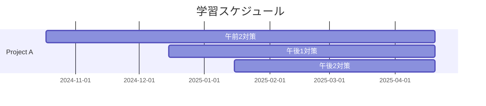

# ネットワークスペシャリスト試験勉強

このリポジトリは、ネットワークスペシャリスト試験の勉強のために作成されました。学習スケジュール、リソース、ノートなどをまとめて、試験対策に役立てることを目的としています。

## 📚 コンテンツ

- [学習スケジュール](#学習スケジュール)
- [リソース](#リソース)
- [ノート](#ノート)
- [学習記録](#練習問題)
- [試験対策のヒント](#試験対策のヒント)

## 🗓 学習スケジュール

6か月間でネットワークスペシャリスト試験の主要トピックをカバーするスケジュールです。

_詳細なスケジュールは [study-schedule.md](study-schedule.md) をご覧ください。_

## 📖 リソース

勉強に役立つリソースをいくつか紹介します：

- **書籍**:
  - 『[徹底攻略 ネットワークスペシャリスト教科書 令和7年度](https://book.impress.co.jp/books/1124101035)』 株式会社わくわくスタディワールド　瀬戸美月
  - 『[マスタリングTCP/IP　入門編（第6版）](https://www.ohmsha.co.jp/book/9784274224478/)』 井上直也, 村山公保 他
  - 『[ルーティング＆スイッチング標準ハンドブック　一番大切な知識と技術が身につく](https://www.sbcr.jp/product/4797380484/)』 Gene, 作本 和則
  - 『[Real World HTTP 第3版 ―歴史とコードに学ぶインターネットとウェブ技術](https://www.oreilly.co.jp/books/9784814400669/)』 渋川 よしき
  - 『[ネットワークはなぜつながるのか　第２版](https://bookplus.nikkei.com/atcl/catalog/07/P83110/)』 戸根 勤
- **ビデオコンテンツ**:
  - [Youtube: まさるの勉強部屋](https://www.youtube.com/channel/UCgBf5j2KIkFBm29Z7fYDG1A)
- **ウェブサイト**:
  - [ネットワークスペシャリスト ドットコム](https://www.nw-siken.com/)

## 📝 ノート

## 📝 学習記録

## 💡 試験対策のヒント

## 📄 ライセンス

このプロジェクトはMITライセンスのもとで公開されています。詳細は [LICENSE](LICENSE) ファイルをご覧ください。